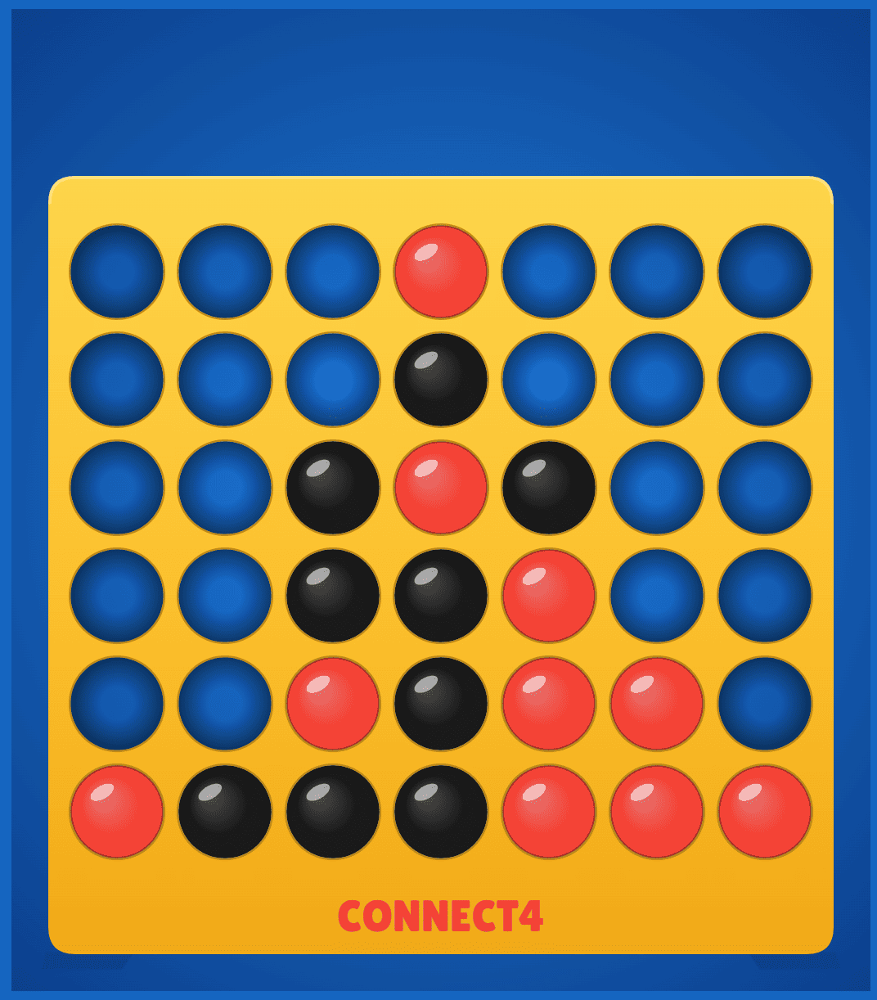

<p align="center">
  
</p>

<h1 align="center">Connect 4</h1>

<p align="center">
  <strong>The classic four-in-a-row, with a bitboard AI opponent and a self-playing welcome screen.</strong>
</p>

<p align="center">
  <a href="https://dangervalentine.github.io/react-connect4/">Live Demo</a>
</p>

<p align="center">
  <a href="https://dangervalentine.github.io/react-connect4/">
    
  </a>
</p>

<p align="center">
  
  
  
  
  
  
</p>

---

A from-scratch Connect 4 rendered entirely on an HTML5 canvas, with a **bitboard-based negamax AI** offering three difficulty profiles, a polished welcome modal with an **attract self-play** demo running behind it, and full keyboard navigation throughout.

## Features

**Opponent modes**

| Mode | Behavior |
|------|----------|
| **Easy** | Heuristic only — always blocks an immediate loss, always takes an immediate win, otherwise weighted-random with a center bias. Plays like a casual human. |
| **Medium** | Depth-4 negamax with α-β. Occasionally picks the 2nd-best move when the gap is small so it doesn't feel mechanical. |
| **Hard** | Depth-7 negamax with α-β + center-out move ordering. Spots traps several moves out and rarely walks into one. |

**Attract self-play** &mdash; Two easy-difficulty bots play each other behind the welcome modal as ambient motion, pausing on each result to let the win pulse play before resetting.

**Win sequence** &mdash; When the winning move lands, the four pieces light up one by one (staggered fade-to-white) before the end-of-game banner appears, so the result has time to register.

**Keyboard navigation** &mdash; Toggle hints with <kbd>K</kbd>. Digit keys <kbd>1</kbd>&ndash;<kbd>7</kbd> drop into columns; <kbd>Esc</kbd> opens the in-game menu; <kbd>←</kbd> <kbd>→</kbd> cycle segmented controls in modals; <kbd>Enter</kbd> activates focused controls.

**Accessibility** &mdash; Visually-hidden buttons mirror the canvas-painted ones for screen readers, segmented controls implement the WAI-ARIA `radiogroup` pattern with roving tabindex, `prefers-reduced-motion` respected throughout.

## How It Works

The AI runs a classic two-player game search on a bitboard representation of the position:

```
Board ──► fromGameBoard() — 49-bit Pascal-Pons encoding
              │
              ▼
       Negamax search (depth depends on difficulty)
              │
              ▼
       At each node:
       ├── α-β pruning with center-out move ordering
       ├── Immediate-win shortcut (mate-soon score)
       └── Recurse into legal children
              │
              ▼
       Leaf nodes: evaluatePosition() heuristic
       ├── 69 precomputed winning-line bitmasks
       ├── Threat weights (3-in-a-row = 50, 2 = 10, 1 = 1)
       └── Center-column bonus
              │
              ▼
       Difficulty wrapper
       ├── Easy   → no search; heuristic + weighted random
       ├── Medium → depth-4 search; 30% chance of near-best move
       └── Hard   → depth-7 search; no sandbagging
```

All move generation, win detection, and evaluation happen on BigInt bitboards (49 bits = 7 columns &times; (6 rows + 1 sentinel)), so winning-line checks are four shift-and-AND operations rather than a quadruple loop.

The renderer is a pure-canvas paint loop driven by `requestAnimationFrame`. Layers composite in order:

```
background vignette → hole back-shadows → pieces → support feet
       → yellow board face with even-odd hole cutouts
       → hole rims → top-arch highlight → hover ghost
       → "CONNECT4" title → in-game MENU button → end banner
```

Pieces are drawn *before* the board face; the board's even-odd fill then punches holes through the yellow, revealing the pieces underneath. Drop animations use a custom easing (gravity-then-damped-bounce) tracked in a separate `AnimState` that lives outside React.

## Quick Start

```bash
npm install
npm run dev        # dev server at http://localhost:3000/react-connect4/
npm run lint       # eslint over src/
npm run build      # type-check + production bundle in ./dist
npm run preview    # serve the production bundle locally
```

Vite's `base` is set to `/react-connect4/` in [`vite.config.ts`](./vite.config.ts) so assets resolve correctly on GitHub Pages. The same base path applies to the dev server URL &mdash; use `/react-connect4/`, not `/`.

## Tech Stack

- **React 19** &mdash; mounts the canvas, owns the modal layer
- **Vite 6** &mdash; dev server, build, GitHub Pages base path
- **TypeScript 5** &mdash; strict mode, project references
- **Zustand 5** &mdash; game store + subscribe-driven AI scheduler
- **Canvas 2D** &mdash; everything board-related is canvas-painted
- **BigInt bitboards** &mdash; 49-bit Pascal-Pons encoding for the AI engine
- **Poppins + Inter** &mdash; display and body type via Google Fonts

## Project Structure

```
src/
├── App.tsx                      Mount canvas, run rAF loop, orchestrate AI + attract
├── main.tsx                     React 19 createRoot entry
├── store.ts                     Zustand game store (state + actions)
├── constants.ts                 Board dimensions + shared types
├── helpers/index.ts             checkGameBoard + isBoardFull
│
├── ai/
│   ├── bitboard.ts              49-bit Pascal-Pons encoding + primitives
│   ├── eval.ts                  69-line heuristic with center-column bonus
│   ├── search.ts                Negamax + α-β with center-out move ordering
│   ├── engine.ts                Difficulty profiles (easy / medium / hard)
│   └── attractDemo.ts           Self-playing demo behind the welcome modal
│
├── canvas/
│   ├── layout.ts                All measurements + hit-boxes from canvas size
│   ├── animations.ts            Mutable AnimState + easing + win-sequence timing
│   ├── input.ts                 Mouse / touch / keyboard wiring
│   └── scene.ts                 Paint pipeline (background → pieces → board → banner)
│
└── components/
    ├── WelcomeModal.tsx         Pre-game setup with arrow-key segmented controls
    ├── ResetConfirmModal.tsx    Mid-game "return to setup?" confirmation
    ├── KeyboardHintsToggle.tsx  Viewport-fixed keyboard-hints toggle (desktop only)
    └── GithubAttribution.tsx    Bottom-right author + source link
```

## Deployment

CI is wired up via GitHub Actions:

- [`.github/workflows/ci.yml`](./.github/workflows/ci.yml) &mdash; lint + build on every pull request and feature branch push.
- [`.github/workflows/deploy.yml`](./.github/workflows/deploy.yml) &mdash; builds and publishes to GitHub Pages on every push to `master`.

The deploy workflow uses the modern `actions/deploy-pages` flow (no `gh-pages` branch). One-time setup on the repo:

1. **Settings → Pages → Build and deployment → Source:** select **GitHub Actions**.
2. Push to `master` (or run the workflow manually from the Actions tab).

If you fork the repo, also update the `base` value in `vite.config.ts` to match your repo name.

## License

[MIT](./LICENSE.md)
